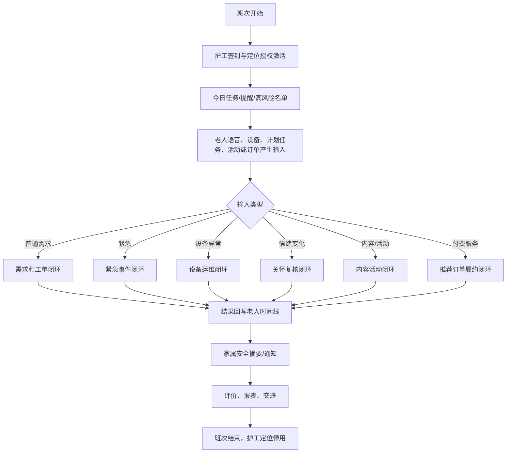
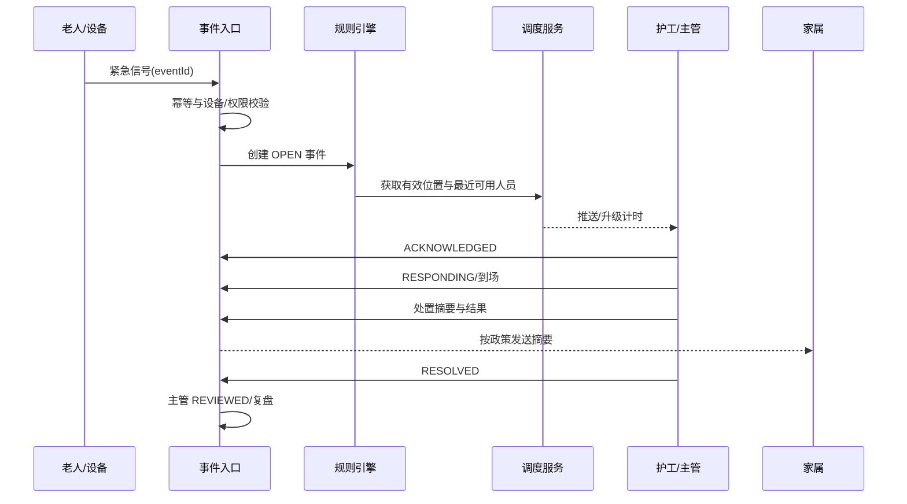
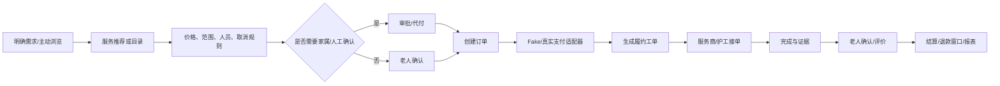

# 11 — 全产品端到端业务流程

本文是所有模块的总流程源文件。任何页面、API、智能体、设备事件、报表和增值服务都必须挂接到这里定义的闭环；禁止新增“只有入口、没有处理结果”的孤立功能。

## 1. 产品总模型

平台由六层组成：

1. **身份与授权层**：组织、院区、用户、角色、数据范围、老人关系、同意与审计。
2. **照护运营层**：老人档案、需求、工单、紧急事件、排班、位置、设备和护理记录。
3. **AI 协调层**：语音转写、需求理解、情绪趋势、沟通草稿、内容播报、多智能体编排。
4. **内容与活动层**：新闻、公告、兴趣、活动、报名、签到和反馈。
5. **服务交易层**：服务目录、服务包、推荐、订阅、订单、支付适配、履约、退款和评价。
6. **运营分析层**：老人 360 时间线、人员绩效、设备可用率、服务收入、活动参与和风险复盘。

统一原则：

```text
所有输入
-> 身份/关系/同意校验
-> 结构化业务事件
-> 确定性规则与工作流
-> 需要时调用受限 AI 智能体
-> 人工审批门
-> 真实任务/内容/服务执行
-> 结果回写
-> 家属安全摘要
-> 评价、报表和审计
```

## 2. 核心参与者

| 参与者 | 主要职责 | 不应获得的能力 |
|---|---|---|
| 平台管理员 | 平台配置、租户管理、系统运行 | 默认读取具体老人敏感内容 |
| 机构/院区负责人 | 运营、资源、风险、报表 | 绕过审计直接改历史记录 |
| 护理主管 | 复核、派单、升级、交班、质检 | 无理由批量导出全部敏感数据 |
| 护工 | 接单、到场、服务、语音记录 | 非班次访问无关老人、查看财务 |
| 医护/康复人员 | 在授权范围内处理专业任务 | 自动改处方或让 AI 代替诊断 |
| 设备管理员 | 设备、网络、维修、替代巡查 | 查看完整病历和家属私密沟通 |
| 内容/活动运营 | 内容审核、活动组织 | 获取无关健康、定位和录音 |
| 服务运营/供应商 | 接收履约任务、上传结果 | 接触非订单所需的老人数据 |
| 老人 | 提需求、呼救、参与活动、购买/评价、管理同意 | 被隐藏操纵、被强制商业推荐 |
| 家属 | 查看授权摘要、沟通、代付、参与决策 | 查看护工实时位置、原始全部录音 |
| AI 智能体 | 在工具权限内生成建议或执行低风险动作 | 独立急救、诊断、高额消费、隐藏说服 |

## 3. 统一入口与统一结果

### 输入入口

- 老人端语音、文字、大按钮和床头终端
- 护工端语音/表单/扫码
- 家属端文字/语音/支付意向
- 管理端人工录入、批量导入
- MQTT 设备心跳、遥测、定位和事件
- 定时任务：新闻更新、活动提醒、设备离线检查、SLA 检查
- 第三方接口：内容源、支付、通知、服务商（均通过适配器）

### 统一结果类型

每次输入最终必须落为至少一种可追踪结果：

- 需求/工单
- 紧急事件
- 设备告警/维修/替代巡查
- 情绪观察/人工关怀任务
- 家属沟通草稿/审批/触达
- 内容播放记录
- 活动推荐/报名/签到/反馈
- 服务推荐/订单/履约/退款
- 评价/申诉/绩效聚合
- 通知/送达状态
- 审计事件

所有结果都进入老人 360 时间线，但按权限返回不同视图。

## 4. 机构初始化流程


验收结果：院区可独立运行，任何用户登录后只能看到其角色和数据范围内的菜单、老人、任务、位置、设备、内容或订单。

## 5. 老人入住与数字档案流程

1. 管理人员创建入住申请或导入预约。
2. 建立老人基本档案、护理等级、禁忌、紧急联系人、家庭关系。
3. 分配院区、房间、床位和照护团队。
4. 分项采集同意：语音、AI 分析、情绪趋势、定位、家属共享、内容偏好、商业推荐。
5. 录入个人基线：作息、沟通习惯、兴趣、常见需求、听视力、活动能力。
6. 绑定床头终端、呼叫器、手环或其他设备。
7. 创建初始照护计划、提醒和服务权益。
8. 家属完成关系验证并看到授权范围说明。
9. 系统生成“入住完成”事件和老人 360 时间线起点。

退出/转院时：终止床位、班组、设备和定位绑定；停止未来提醒与推荐；按保留政策归档或删除数据；未完成订单和事件必须先处理。

## 6. 日常运营总循环



## 7. 老人语音需求到服务完成

### 正常路径

1. 老人点击“说需求”或对床头终端讲话。
2. 系统明确提示“正在与 AI 关怀助手交流”，并提供转人工。
3. 上传音频，生成 `VoiceSubmission`；失败时保留本地草稿或提供人工呼叫。
4. 转写适配器生成 `Transcript`。
5. 结构化分析智能体输出摘要、类别、建议优先级、风险标记、情绪观察和追问。
6. JSON Schema 校验；失败则进入人工处理队列。
7. 确定性规则判断：普通、优先、疑似紧急、需人工复核。
8. 生成 `Need`；需要服务时生成 `WorkOrder`。
9. 派单引擎依据技能、班次、楼层、当前负荷和有效位置推荐护工。
10. 护理主管自动或人工确认分配。
11. 护工收到最小化推送，打开详情后后端再次鉴权。
12. 护工接单、到场、开始处理；每次状态转换写入不可变时间线。
13. 护工使用语音汇报完成内容，AI 只负责生成记录草稿。
14. 护工确认后提交；高风险任务由主管/老人复核。
15. 系统生成家属可见摘要，过滤内部备注、原始录音和无关敏感信息。
16. 老人可进行简化评价；低评分可触发质检但不自动处罚。
17. 需求、工单、通知、评分和用时进入报表与绩效聚合。

### 异常路径

- 音频无法识别：提示重试/转人工，不伪造结果。
- AI 超时：创建“待人工分类”的需求。
- 无可用护工：升级主管并显示排队原因。
- 护工拒单/超时：重新派单并保留原因。
- 老人无法确认完成：主管复核，不强制好评。
- 工单取消：必须记录取消人、原因和是否通知老人/家属。

## 8. 紧急事件端到端

触发来源：老人一键呼救、语音明确危险、跌倒设备、越界规则、护工人工创建。



关键规则：

- AI 只能识别疑似风险，不能独立关闭或判定无风险。
- 位置过期时显示未知，并给出房间/最后位置/人工确认路径。
- 未确认、未到场、未解决分别具有独立 SLA 和升级链。
- 同一设备 `eventId` 幂等；相近重复事件可关联但不可静默丢弃。
- 事件解决后仍需主管复盘或记录豁免。

## 9. 设备离线到替代照护

1. 设备按版本化 MQTT 主题发送心跳。
2. Worker 根据期望间隔和阈值检查离线。
3. 创建唯一活跃 `DeviceAlert`，标记设备重要等级和影响能力。
4. 非关键设备：通知设备管理员、生成维修工单。
5. 关键设备：同时创建替代巡查任务，通知护理主管。
6. 地图将设备标为离线，显示最近心跳和影响的老人/区域。
7. 维修人员确认、处理、记录原因和更换配件。
8. 设备恢复后需满足稳定心跳窗口，状态转为 `RECOVERED`。
9. 人工确认替代巡查已撤销、业务能力恢复后 `CLOSED`。
10. 离线时长、重复故障和替代巡查进入设备可用率报表。

不得因设备恢复而自动删除维修记录或未完成巡查。

## 10. 情绪趋势到人工关怀

1. 老人明确同意情绪趋势观察。
2. AI 对单次语音只生成非诊断性观察、置信度和证据。
3. 趋势服务与个人基线比较，不与其他老人直接比较。
4. 连续满足阈值时生成 `EmotionObservation: NEEDS_REVIEW`。
5. 护理人员查看有限上下文，确认或驳回。
6. 确认后创建关怀任务，可建议联系家属、活动邀请或专业人员。
7. 人工完成关怀并记录结果；系统不写“抑郁症/失智”等诊断。
8. 家属是否收到摘要取决于老人授权和风险政策。
9. 所有 AI 建议与人工修正保留，进入模型质量报表。

商业推荐不得利用情绪脆弱状态触发高压销售；高风险情绪期间默认暂停付费推荐。

## 11. 家属沟通助手

1. 家属选择具体老人并提交沟通困扰。
2. 系统验证关系和共享授权。
3. 沟通智能体生成：建议表达、原因、可能触发点、需人工参与事项。
4. 草稿明确标注 AI 生成，不冒充医生或家属本人。
5. 涉及医疗、财务、法律、入住/转院决定时强制人工审核。
6. 家属可编辑并选择：仅自己参考、发送给工作人员、请求 AI 在老人知情下辅助表达。
7. 若与老人对话，系统说明信息来源并允许老人拒绝或转人工。
8. 触达结果、老人反馈和后续任务写入时间线。
9. 不允许创建“秘密说服”“持续施压”“绕过拒绝”的任务。

## 12. 新闻、公告和内容播报

1. 内容服务从已配置来源抓取或由机构编辑创建内容。
2. 内容进入 `DRAFT -> REVIEW -> PUBLISHED` 审核流程。
3. 新闻必须保存来源、发布时间、抓取时间、摘要版本和适用区域。
4. 内容智能体按老人语言、听力、兴趣和时长偏好生成播报稿，但不改变事实含义。
5. 推荐前检查同意、内容偏好、免打扰时间和认知适配。
6. 老人可说“播报今天新闻”“跳过”“以后少讲这类内容”。
7. 播放/阅读行为只用于偏好和服务改进，不作为健康诊断。
8. 灾害、诈骗、公共安全类内容可按机构策略提高优先级；仍需来源和日期。
9. 付费或赞助内容必须明确标识，不与紧急提醒混淆。

## 13. 兴趣与活动闭环

1. 老人或工作人员维护兴趣、活动能力、时间偏好和禁忌。
2. 活动运营创建活动模板和场次：时间、地点、容量、适用条件、费用、负责人。
3. 匹配服务生成可解释推荐：兴趣匹配、时间无冲突、能力适合、本人同意。
4. AI 通过老人端语音邀请，老人可报名、拒绝或请求人工解释。
5. 收费活动进入订单流程；免费活动直接占位。
6. 活动前发送提醒，必要时创建护送/接送工单。
7. 到场扫码、设备或工作人员签到；缺席记录原因而非自动负面评价。
8. 活动结束收集反馈和状态观察。
9. 系统生成参与度、满班率、缺席率和兴趣覆盖报表。
10. 长期未参与且本人希望社交时，可创建人工关怀建议，不能强迫参加。

## 14. 服务推荐、服务包与订单履约

### 推荐前置条件

- 有明确需求或已订阅权益。
- 老人允许接收相关类型推荐。
- 不处于紧急事件、明显认知/情绪脆弱或争议状态。
- 推荐原因可解释，付费/广告标识清晰。

### 订单闭环



服务包支持：基础关怀、健康记录、康复活动、生活服务、家属安心、兴趣活动等。首版支付使用 FakePaymentProvider；真实支付必须后续单独安全评审。

保护规则：

- 单笔/月度限额和二次确认。
- 认知受限、高额或长期合同必须家属/工作人员共同确认。
- 可取消、退款和申诉。
- 不销售未经机构审核的医疗、金融、保健品或高风险服务。
- 推荐权重不得因服务佣金压过照护安全和老人意愿。

## 15. 评分、排行榜与绩效

1. 服务完成后，老人用语音/大按钮评分，可选择“不评价”。
2. 家属可对其实际看到的服务进行评价。
3. 护工可补充工作难度和异常说明，但不能改评分。
4. 系统生成可配置综合分：时效、完成率、质检、评价、任务难度、样本量。
5. 低样本量不排名；不公开末位；不自动处罚。
6. 表扬可进入“优秀服务”展示，投诉进入独立复核。
7. 任何分数变动显示构成、周期和数据来源，并支持申诉。

## 16. 报表与运营 AI

管理者可通过筛选页或运营智能体查询：

- 老人需求、风险、情绪观察和服务趋势
- 工单响应中位数/P90、超时、重开和完成质量
- 紧急事件确认/到场/解决时间
- 设备可用率、离线原因和重复故障
- 护工负荷、班次覆盖和绩效组成
- 内容播放、活动报名/到场/满意度
- 服务包订阅、订单、退款、履约和收入
- AI 分类修正率、失败率和人工介入率

运营智能体只能调用经过授权的聚合查询工具。它不直接读取无关原始录音，不跨租户汇总可识别数据，导出仍需独立权限和审计。

## 17. 多智能体统一编排

所有老人/家属输入先进入单一编排入口，不直接暴露多个模型：

```text
输入
-> 身份、关系、同意、当前事件上下文
-> 意图路由
-> 风险等级
-> 选定一个主智能体
-> 按工具白名单调用系统能力
-> 输出策略校验
-> 低风险自动执行 / 中高风险人工审批
-> 结果与审计
```

主智能体可包括：照护协调、情绪关怀、家庭沟通、新闻内容、活动兴趣、健康记录、服务推荐、护工助手、机构运营。工具权限和审批门见 `docs/13-MULTI-AGENT-ORCHESTRATION.md`。

## 18. 统一数据与事件约束

- PostgreSQL 是系统记录源；搜索、缓存和报表不能成为事实源。
- 业务写入与领域事件使用事务 outbox。
- 每个事件有 organizationId、facilityId、actor、correlationId、occurredAt、schemaVersion、idempotencyKey。
- 事件消费者必须幂等；失败进入可见重试/死信队列。
- 同一用户旅程共享 correlationId，便于追踪从语音到工单、订单、通知和报表。
- 老人时间线保存引用和摘要，不复制全部敏感原文。

## 19. 完整“一个老人一天”演示

1. 老人早晨收到天气、今日安排和已订阅新闻播报。
2. 老人说“午饭想吃清淡一点，下午想下象棋”。
3. AI 拆分为饮食需求和活动兴趣；生成餐饮工单与象棋活动推荐。
4. 护工接单并确认饮食安排；老人报名活动。
5. 活动前创建引导任务；护工在有效班次地图中找到老人。
6. 活动签到并记录参与反馈。
7. 老人下午说“头有点晕，还想买一个助浴服务包”。
8. 风险规则先创建优先健康回访，暂停即时商业推荐。
9. 护工到场确认无紧急情况并记录；主管复核后恢复服务浏览。
10. 家属收到安全摘要，并可代付已明确选择的助浴服务。
11. 订单生成履约工单，服务完成后老人评价。
12. 晚间关键呼叫设备离线，系统创建维修和替代巡查。
13. 设备恢复并稳定后关闭告警。
14. 管理工作台显示当日需求、活动、订单、设备和服务质量；所有链路可审计。

该演示不代表所有动作都应自动完成；所有审批门和限制必须真实存在。
