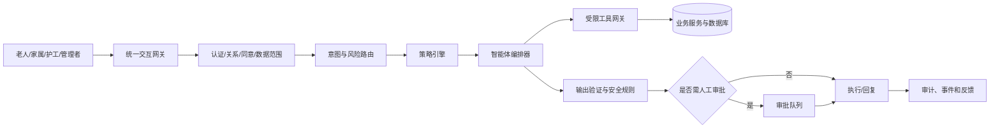

# 13 — 多智能体编排与工具权限

多智能体不是多个聊天窗口，而是一个统一入口背后的岗位化能力。用户只需要面对“AI 关怀助手/机构助手”；系统根据身份、意图、风险和授权选择智能体。

## 1. 总体架构



编排器不直接访问数据库。所有读写通过工具网关和后端授权服务完成。

## 2. 智能体注册模型

`AgentDefinition` 至少包含：

- agentKey、名称、版本、用途
- 允许的角色/入口
- 输入 schema、输出 schema
- 工具白名单
- 数据敏感等级
- 最大执行步数、超时、成本预算
- 自动执行风险上限
- 必须人工审批的动作
- prompt/version/model/provider
- 启用院区与灰度配置

`AgentRun` 至少包含：

- actor、elder context、session/correlation ID
- selected agent and reason
- consent snapshot
- tools requested/allowed/denied
- prompt/model/schema version
- structured output
- policy decisions
- reviewer decision
- final business result IDs
- latency/cost/error status

不得保存不必要的完整内部思维过程；只保存可审计的输入摘要、工具调用、决策理由和结果。

## 3. 智能体清单

### CareCoordinationAgent — 照护协调

用途：需求理解、追问、创建人工复核草稿、查询工单进度。

允许工具：

- `elder.get_allowed_context`
- `need.create_draft`
- `work_order.get_status`
- `human_handoff.create`

禁止：直接关闭紧急事件、修改护理等级、读取其他老人。

### EmotionSupportAgent — 情绪关怀

用途：温和对话、生成非诊断观察、建议人工关怀或活动。

允许工具：

- `emotion.create_observation_draft`
- `activity.search_eligible`
- `human_handoff.create`

禁止：诊断、承诺保密于所有风险场景、以付费服务解决情绪问题。

### FamilyCommunicationAgent — 家庭沟通

用途：生成家属沟通建议和可审核草稿。

允许工具：

- `family.get_sharing_policy`
- `communication.create_draft`
- `communication.request_staff_review`

禁止：冒充老人/家属/医生、秘密说服、发送未经批准的高风险内容。

### ContentNewsAgent — 内容新闻

用途：读取已审核内容、按偏好摘要、播报和回答来源问题。

允许工具：

- `content.search_published`
- `content.get_source_metadata`
- `preference.update_content_feedback`
- `speech.synthesize`

禁止：抓取未审核未知来源后直接播报、将广告伪装为新闻。

### ActivityAgent — 活动兴趣

用途：查询活动、解释推荐、报名/取消低风险免费活动。

允许工具：

- `activity.search_eligible`
- `activity.explain_recommendation`
- `activity.enroll_free`
- `activity.cancel_enrollment`

收费活动或需要陪同/专业评估时必须审批。

### HealthRecordAgent — 健康记录助手

用途：汇总已记录测量、提醒既定计划、生成给医护人员的摘要。

允许工具：

- `care_plan.get_allowed_summary`
- `measurement.get_trend`
- `reminder.confirm`
- `clinical_handoff.create`

禁止：诊断、建议停药/换药、解释为确定疾病。

### ServiceRecommendationAgent — 服务推荐

用途：基于明确需求或主动浏览解释服务、权益和价格。

允许工具：

- `service.search_eligible`
- `entitlement.get_available`
- `recommendation.create`
- `checkout.create_intent`

禁止：直接支付、高额下单、利用情绪/疾病恐惧推销、隐藏赞助关系。

### CaregiverCopilotAgent — 护工助手

用途：任务摘要、语音完成记录、交班摘要和注意事项。

允许工具：

- `work_order.get_assigned`
- `care_note.create_draft`
- `handover.create_draft`
- `location.get_allowed_elder_presence`

禁止：扩大数据范围、自动签名完成、查看无关家属沟通。

### OperationsAgent — 机构运营

用途：执行授权聚合查询、生成报表解释和行动建议。

允许工具：

- `analytics.query_aggregate`
- `report.create_draft`
- `dashboard.get_metrics`

禁止：运行任意 SQL、返回原始敏感记录、执行人员处罚。

## 4. 风险分级与审批门

### L0 — 只读/解释

示例：查询今日安排、已发布新闻、工单进度。可自动完成。

### L1 — 低风险可逆动作

示例：更新内容偏好、报名免费活动、确认收到提醒。需要身份和同意校验，可自动完成并提供撤销。

### L2 — 中风险业务动作

示例：创建工单草稿、发送家属沟通草稿、取消付费活动、创建服务结算意向。必须明确确认或工作人员审批。

### L3 — 高风险动作

示例：紧急事件状态、医疗相关决定、高额消费、长期订阅、向家属分享敏感情绪/健康内容。AI 不得自动完成，必须具备人工审批和业务规则。

### L4 — 禁止动作

- 医疗诊断/处方决策
- 隐蔽操纵老人
- 代表老人作出法律/财务重大决定
- 绕过拒绝或同意撤回
- 跨租户读取
- 删除审计和历史事件

## 5. 工具契约

每个工具必须声明：

```ts
interface AgentToolDefinition<I, O> {
  key: string;
  version: string;
  inputSchema: JsonSchema<I>;
  outputSchema: JsonSchema<O>;
  requiredPermissions: string[];
  riskLevel: 'L0' | 'L1' | 'L2' | 'L3';
  idempotent: boolean;
  requiresElderConsent?: string[];
  requiresHumanApproval?: boolean;
  execute(input: I, context: ToolContext): Promise<O>;
}
```

工具返回最小数据，不将完整领域对象直接交给模型。精确位置、完整转写、健康详情和家属私密内容分别使用专门工具和权限。

## 6. 意图路由

路由顺序：

1. 先运行确定性紧急关键词/设备规则。
2. 再进行身份与场景判断：老人、家属、护工、管理者。
3. 识别一个主意图和可选子意图。
4. 涉及多个意图时拆分为多个业务草稿，不让单个智能体跨岗位执行。
5. 每次只允许一个主智能体写入，其他智能体可提供只读建议。

示例：

> “我头晕，下午还想报名唱歌，再帮我买助浴包。”

拆分：

- 健康担忧 -> 照护协调/人工复核，优先处理。
- 唱歌活动 -> 暂存推荐，待健康复核后继续。
- 助浴包 -> 暂存服务意向，不立即推荐或下单。

## 7. 上下文与记忆

允许的长期记忆：

- 老人主动设置的称呼、语言、内容和活动偏好
- 已确认的作息、沟通方式和无障碍需求
- 已完成服务和活动的结构化记录
- 授权范围内的个人基线

不应进入通用长期记忆：

- 未经确认的情绪推测
- 全部原始录音和对话
- 一次性家庭争执
- 工具返回的其他人员数据
- 超出保留期的精确位置

记忆写入必须区分 `user_asserted`、`staff_confirmed`、`inferred`，推测不能覆盖本人明确表达。

## 8. Prompt injection 与数据泄露防护

- 用户文本、新闻正文、服务商描述和附件都视为不可信数据。
- 不允许内容文本修改系统指令、工具权限或审批门。
- 工具调用参数由结构化 schema 和服务端上下文生成，不能直接信任模型拼接的 organizationId/elderId。
- 输出前运行敏感信息过滤和角色视图转换。
- 模型不能获得数据库凭证、任意网络工具或通用代码执行能力。
- 外部内容抓取与老人交互模型隔离，内容先审核入库。

## 9. 失败与降级

- 模型不可用：显示人工入口，核心工单/紧急流程仍可运行。
- 工具超时：不宣称执行成功；返回可重试状态。
- 输出 schema 无效：重试一次后转人工。
- 多次路由不确定：询问一个必要澄清问题或转人工。
- 风险分类冲突：采用更保守的人工复核路径。
- 智能体预算耗尽：保存草稿和上下文，不无限循环。

## 10. 可观测性

指标：

- 路由准确率和人工改派率
- 工具拒绝/失败/超时
- schema 失败率
- 人工审批通过/修改/拒绝
- 每类智能体平均步数、延迟和成本
- AI 建议转化为真实闭环结果的比例
- 安全规则命中和潜在泄露拦截

不得以“对话轮数”作为核心成功指标；核心是安全、正确、可执行的结果。

## 11. 测试

- 每个工具的允许/拒绝权限测试
- L2/L3 审批门不可绕过
- 紧急意图优先于内容/商业意图
- 跨老人/跨机构 prompt injection 测试
- 外部新闻正文中的恶意指令不影响工具
- 重复工具调用幂等
- 模型失败和人工降级
- 老人撤回同意后工具立即拒绝
- 输出不包含护工实时位置、其他老人或内部备注
