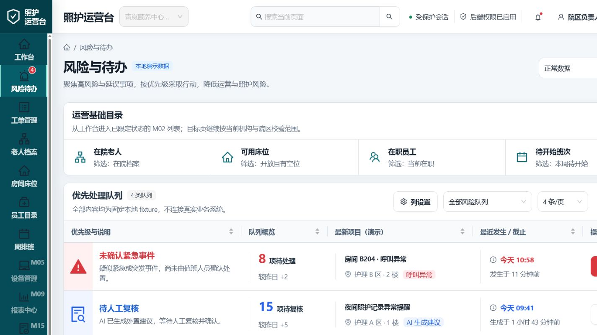
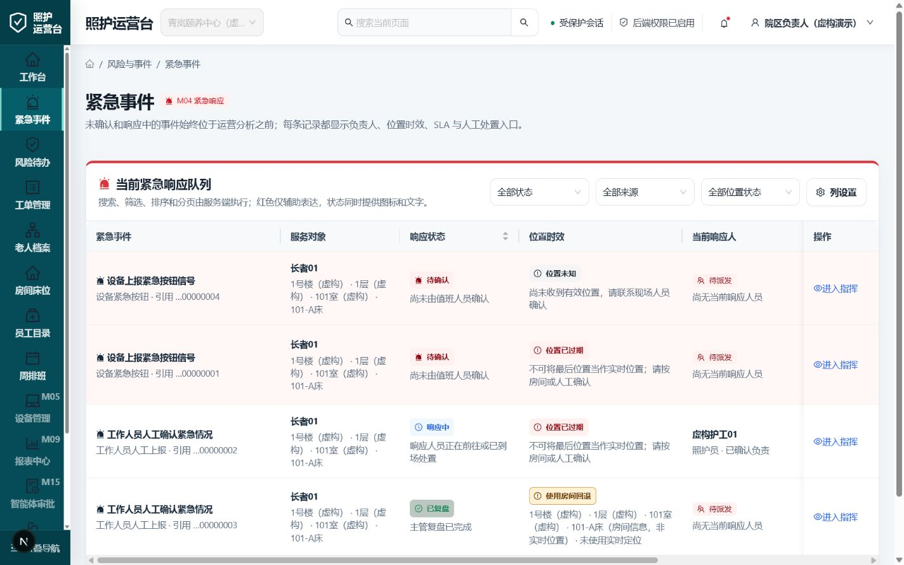
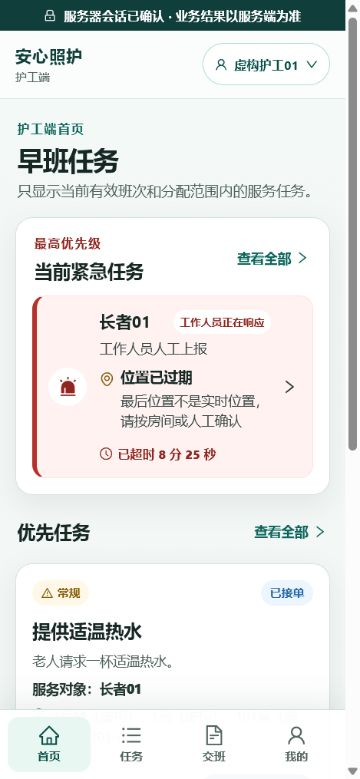
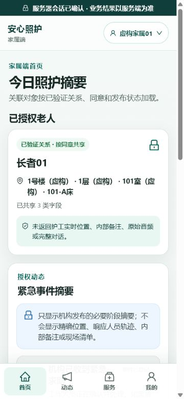

# M04 Emergency visual QA

Date: 2026-07-28

Scope: compare the accepted M03 surfaces with the M04 emergency workflow at the same desktop and mobile viewports. All people, rooms, events, phone numbers, and organizations shown below are fictional local fixtures.

## Comparison matrix

| Surface | Reference | M04 result | Viewport | Result |
|---|---|---|---|---|
| Admin risk queue → live emergency queue | `reference-admin-risk-queue-1440x900.png` | `current-admin-emergency-queue-1440x900.png` | 1440×900 | passed |
| Elder home entry → confirmed emergency | `reference-elder-home-375x812.png` | `current-elder-emergency-confirmed-375x812.png` | 375×812 | passed |
| Caregiver home → emergency-first queue | `reference-caregiver-home-375x812.png` | `current-caregiver-emergency-queue-375x812.png` | 375×812 | passed |
| Family home → privacy-filtered emergency summary | `reference-family-home-375x812.png` | `current-family-emergency-summary-375x812.png` | 375×812 | passed |

## Admin queue

- The fixed fixture row is replaced by a server-backed emergency queue.
- OPEN and active events precede decorative analytics.
- Status, location freshness, current responder, SLA, and action are represented by text and icons; color is supplementary.
- Search/filter/sort/pagination and column visibility remain server-backed controls.
- QA found a real grid min-content overflow at 1440 px. Adding `min-width: 0` to direct M04 grid children keeps horizontal scrolling inside the table instead of expanding the document.

## Elder emergency

- The critical action creates a real idempotent signal and does not claim success before a `200` server response.
- The confirmed state separates “registered” from “human response started.”
- The fallback phone and direct-life-danger instruction remain visible without implying that the app replaces emergency services.
- Critical controls meet the 56 px elder target and the page has no horizontal overflow.

## Caregiver response

- The active emergency queue now precedes ordinary work orders.
- The card includes source, state, location freshness, and an SLA timer.
- Stale location is explicitly described as stale and directs the caregiver to room or human confirmation.
- The command flow enforces acknowledge → en route → on site → resolve with server-owned versions and checklist requirements.

## Family-safe summary

- The family surface adds only released stage summaries and notification preferences.
- It does not expose precise live location, caregiver trajectory, internal notes, raw signal content, or operational checklists.
- Relationship, consent, organization, facility, sharing, and notification preference are rechecked before delivery.

## Interaction and accessibility evidence

- In-app browser verification used the exact 1440×900 and 375×812 viewports and compared reference/current captures together.
- Elder signal creation returned a server-confirmed event and opened its status route.
- Caregiver and family sessions loaded only their role-derived projections.
- Full Playwright E2E passed 24/24 across desktop and mobile viewports, including serious/critical Axe checks.
- Production offline PWA regression passed 1/1; protected portal content was not restored from cache.
- No document-level horizontal overflow remained after the admin grid fix.

final result: passed
